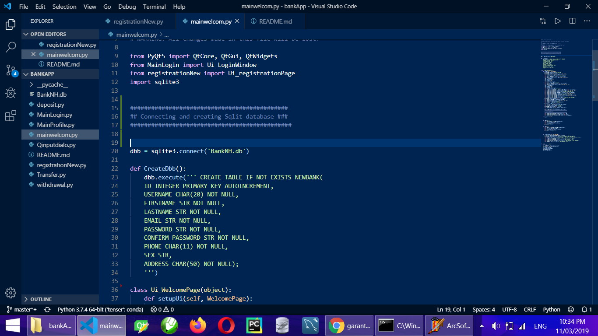
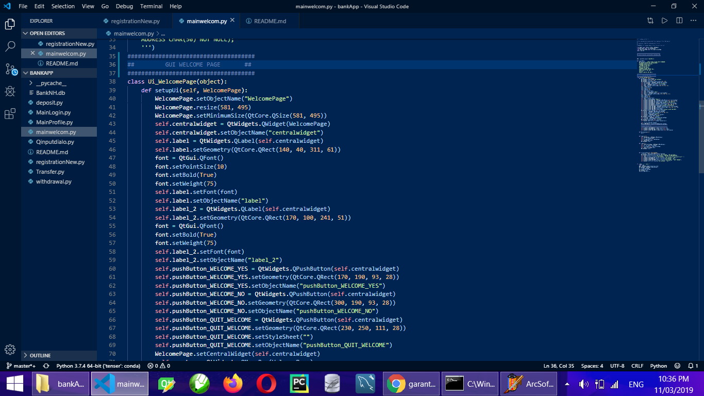
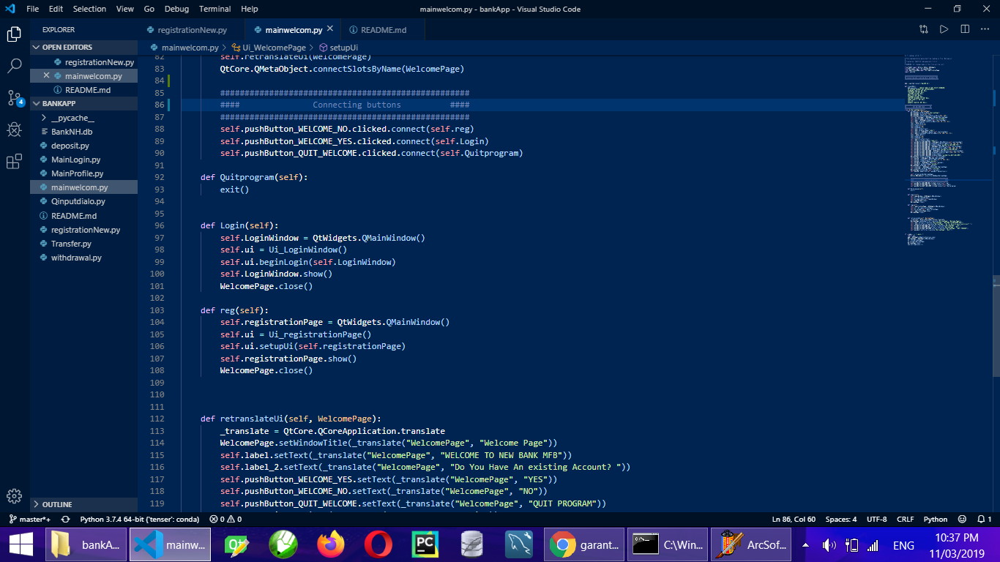
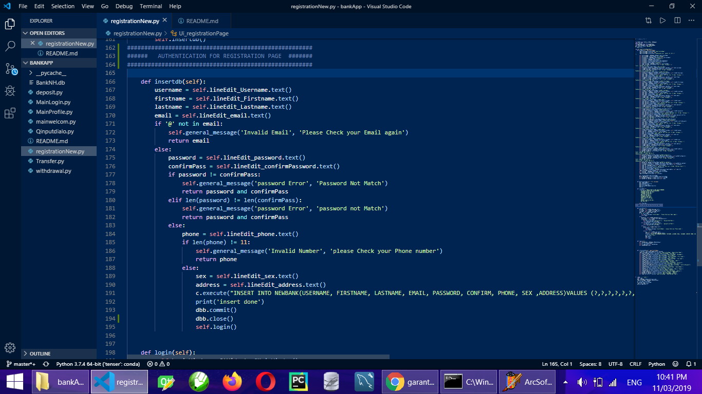
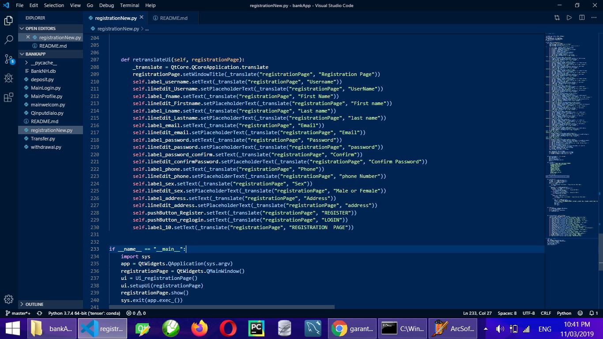
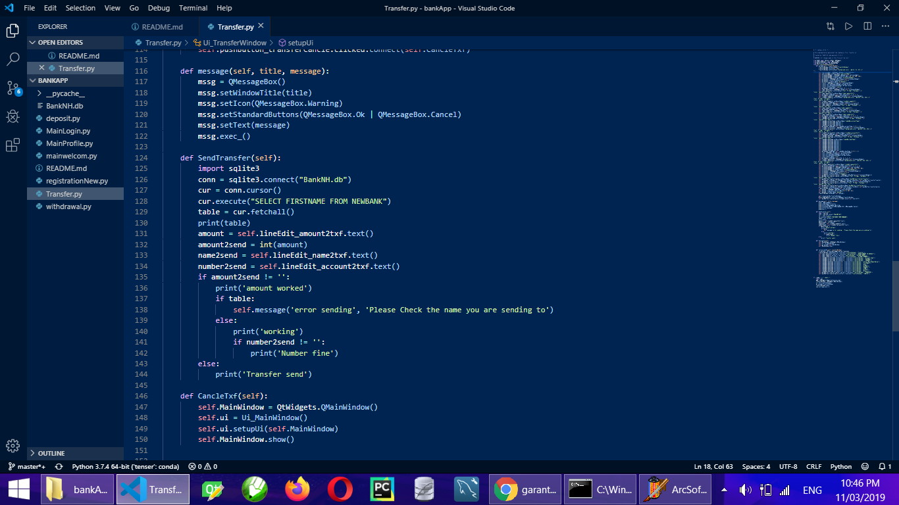

# Bank App
## Banking app using python, pyQt5 and sqlite for database

# INTRODUCTIONS

This is a simulation of a simple banking Desktop Application using Python for the core coding, This software can be use for day to day operations of Most banks with little or no need adjustment

#  FEATURES
- User Registration
- Acoount Balance Check
- Deposit with It own window
- withdrawal with a one time Generated Code
- Good Authentication
- Edit profile
- Delete Account
- Logout

# Dependencies
- Python=3.7.3
- PyQT5=5.11.6
- Sqlite3 (if not installed before)

# Installation

Clone this repo to an enviroment/folder on your machine and install dependencies after all instatllation has been done, Rund the `Mainwelcom.py` file

> python mainwelcom.py

### Do not forget to connect to mysql using your own details

# SCREENSHOTS
___

___

___

___

___

___

___

# Conclusion

This is a free app to be use by anyone.
___

THANKS FOR USING

___
